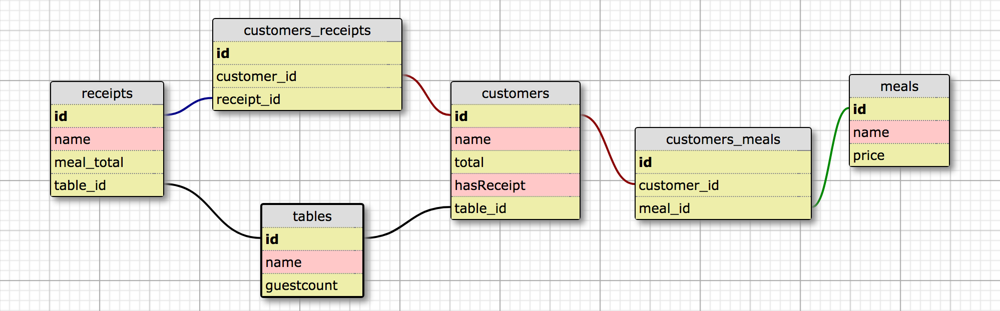

# Restaurant Management System

#### _A Restaurant Management System that allows the manager to add/edit menu items, add table names and number of guests per table, order meals for each customer, calculate the total cost of the meal/s for each customer, and assign one or more bills to a customer._

#### By _**Joe Kramer, Esvethlynna Pangelinan, Emilie Thoreson, and Witty Chang**_

## Database Schema



## What's Included

```
restaurant-management-system
  ├── README.md
  ├── build.gradle
  ├── schema.png
  ├── .gitignore
  └── src
       ├── main
       │     ├── java
       │     │     ├── App.java
       │     │     ├── Customer.java
       │     │     ├── DB.java
       │     │     ├── Meal.java
       │     │     ├── Receipt.java
       │     │     ├── Table.java
       │     │     └── VelocityTemplateEngine.java
       │     └── resources
       │             ├── public
       │             │      ├── app.css
       |             |      └── favicon-96x96.png
       │             └── templates
       │                    ├── aboutus.vtl
       │                    ├── customer.vtl
       │                    ├── index.vtl
       │                    ├── layout.vtl
       │                    ├── meal.vtl
       │                    ├── menu.vtl
       │                    └── table.vtl
       └── test
             └── java
                   ├── CustomerTest.java
                   ├── DatabaseRule.java
                   ├── MealTest.java
                   ├── ReceiptTest.java
                   └── TableTest.java
```

### Setup/Installation Requirements

You will need [gradle](https://gradle.org/gradle-download/) and PostgreSQL installed on your device.

Enter the following commands in your terminal:
* `$ git clone https://github.com/joe-kramer/restaurant-management-system.git`;
* In a new terminal window, `$ postgres` to start the PostgreSQL server;
* In another terminal window, `$ psql` to launch PSQL.


### Database Setup

In PSQL:

* _CREATE DATABASE restaurant_management_system;_
* _\c restaurant_management_system;_
* _CREATE TABLE customers (id serial PRIMARY KEY, table_id int, name varchar, total float, hasReceipt boolean);_
* _CREATE TABLE meals (id serial PRIMARY KEY, name varchar, price float);_
* _CREATE TABLE tables (id serial PRIMARY KEY, name varchar, guestcount int);_
* _CREATE TABLE receipts (id serial PRIMARY KEY, meal_total float, tableid int, name varchar);_
* _CREATE TABLE customers_meals (id serial PRIMARY KEY, customer_id int, meal_id int);_
* _CREATE TABLE customers_receipts (id serial PRIMARY KEY, customer_id int, receipt_id int);_
* _CREATE DATABASE restaurant_management_system_test WITH TEMPLATE restaurant_management_system;_

In your terminal:
* To already have menu items available in your database, type `$ psql restaurant_management_system < media.sql;`
* `$ gradle run` to run the application;
* Navigate to http://localhost:4567 in a web browser of your choice.

## Support and contact details

Please feel free to contact joekramer11@yahoo.com if you have any questions, issues, concerns, comments or suggestions.

## Technologies Used

* Java
* jUnit
* Gradle
* PostgreSQL
* Spark

### License

_Permission is hereby granted, free of charge, to any person obtaining a copy of this software and associated documentation files (the "Software"), to deal in the Software without restriction, including without limitation the rights to use, copy, modify, merge, publish, distribute, sublicense, and/or sell copies of the Software, and to permit persons to whom the Software is furnished to do so, subject to the following conditions:

The above copyright notice and this permission notice shall be included in all copies or substantial portions of the Software.

THE SOFTWARE IS PROVIDED "AS IS", WITHOUT WARRANTY OF ANY KIND, EXPRESS OR IMPLIED, INCLUDING BUT NOT LIMITED TO THE WARRANTIES OF MERCHANTABILITY, FITNESS FOR A PARTICULAR PURPOSE AND NONINFRINGEMENT. IN NO EVENT SHALL THE AUTHORS OR COPYRIGHT HOLDERS BE LIABLE FOR ANY CLAIM, DAMAGES OR OTHER LIABILITY, WHETHER IN AN ACTION OF CONTRACT, TORT OR OTHERWISE, ARISING FROM, OUT OF OR IN CONNECTION WITH THE SOFTWARE OR THE USE OR OTHER DEALINGS IN THE SOFTWARE._

Copyright (c) 2017 **_Joe Kramer, Esvethlynna Pangelinan, Emilie Thoreson, and Witty Chang_**
